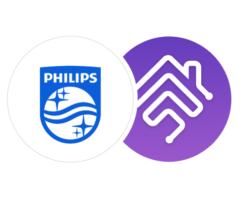

<p align="center">
    
</p>

# homebridge-philipsairplus-platform

<!--
[](https://www.npmjs.com/package/homebridge-philipsair-platform)
[](https://www.npmjs.com/package/homebridge-philipsair-platform)
[](https://github.com/SeydX/homebridge-philipsair-platform)
[](https://github.com/homebridge/homebridge/wiki/Verified-Plugins)
[](https://discord.gg/kqNCe2D)
[](https://www.paypal.com/cgi-bin/webscr?cmd=_s-xclick&hosted_button_id=NP4T3KASWQLD8)

**Creating and maintaining Homebridge plugins consume a lot of time and effort, if you would like to share your appreciation, feel free to "Star" or donate.**
-->

This is a plugin for Philips Air+ Smart Tower Heaters.

## Installation

After [Homebridge](https://github.com/homebridge/homebridge) has been installed:

```
sudo npm install -g --unsafe-perm homebridge-philipsairplus-platform@latest
```

The plugin uses a library based on `python3`. To use the plugin, Python/Pip must be installed!

```
sudo apt install python3-pip git
```

You also need the `phipsair` module from [M. Frister](https://github.com/mfrister/phipsair):

```
sudo pip3 install -U phipsair
```

## How to get the deviceId needed for the configuration?

Use the following phipsair command replacing the `<ip-address>` with the ip address of your device.
```
phipsair -H <ip-address> status -J
```

## Example Config

```
{
   ...
    "platforms": [
        {
            "platform": "PhilipsAirPlusPlatform",
            "name": "PhilipsAirPlusPlatform",
            "devices": [
                {
                    "active": true,
                    "debug": false,
                    "name": "Heater",
                    "deviceId": "4c9c6904ca0f11afb5691bcd86317a2a",
                    "type": "heater",
                    "ip_address": "192.168.10.77"
                    "port": 5683
                }
            ]
        }
    ]
}

```

| Fields           | Description                                                  | Default                    | Required |
|------------------|--------------------------------------------------------------|----------------------------|----------|
| **platform**     | Must always be `PhilipsAirPlusPlatform`.                     | `"PhilipsAirPlusPlatform"` | Yes      |
| **name**         | For logging purposes                                         | `"PhilipsAirPlusPlatform"` | Yes      |
| devices          | Array of Philips air purifiers.                              |                            | Yes      |
|- active          | Whether the device is active and should be used              |                            | Yes      |
|- debug           | Enables additional output (debug) in the log.                | `false`                    | No       |
|- name            | Unique name of your device.                                  |                            | Yes      |
|- **deviceId**    | Device unique identifier                                     |                            | Yes      |
|- type            | Unique name of your device.                                  | Must be `heater` for now   | Yes      |
|- **ip_address**  | Host/IP address of your device.                              |                            | Yes      |
|- port            | Port of your device.                                         | `5683`                     | No       |


# Tested devices

The following devices have been tested with this plugin and confirm that they work without problems

- CX5120/11

# Supported clients

This plugin has been verified to work with the following apps/systems:

- iOS > 13
- Apple Home
- Homebridge >= v1.3.0
- Node >= 14


# Contributing

> This project is heavily inspired by Seydx's [homebridge-philipsair-platform](https://github.com/SeydX/homebridge-philipsair-platform) and - Since the plugin didn't support heaters and coolers I extended it. The **homebridge-philips-air** was a very great help for the implementation!

You can contribute to this homebridge plugin in following ways:

- Report issues and help verify fixes as they are checked in.
- Review the source code changes.
- Contribute bug fixes.
- Contribute changes to extend the capabilities
- Pull requests are accepted.

# Troubleshooting
If you have any issues with the plugin then you can run this plugin in debug mode, which will provide some additional information. This might be useful for debugging issues. Just open your config ui and set debug to true!

# Disclaimer

All product and company names are trademarks™ or registered® trademarks of their respective holders. Use of them does not imply any affiliation with or endorsement by them.

# License

### MIT License

Copyright (c) 2024 André Vieira

Permission is hereby granted, free of charge, to any person obtaining a copy of this software and associated documentation files (the "Software"), to deal in the Software without restriction, including without limitation the rights to use, copy, modify, merge, publish, distribute, sublicense, and/or sell copies of the Software, and to permit persons to whom the Software is furnished to do so, subject to the following conditions:

The above copyright notice and this permission notice shall be included in all copies or substantial portions of the Software.

THE SOFTWARE IS PROVIDED "AS IS", WITHOUT WARRANTY OF ANY KIND, EXPRESS OR IMPLIED, INCLUDING BUT NOT LIMITED TO THE WARRANTIES OF MERCHANTABILITY, FITNESS FOR A PARTICULAR PURPOSE AND NONINFRINGEMENT. IN NO EVENT SHALL THE AUTHORS OR COPYRIGHT HOLDERS BE LIABLE FOR ANY CLAIM, DAMAGES OR OTHER LIABILITY, WHETHER IN AN ACTION OF CONTRACT, TORT OR OTHERWISE, ARISING FROM, OUT OF OR IN CONNECTION WITH THE SOFTWARE OR THE USE OR OTHER DEALINGS IN THE SOFTWARE.
